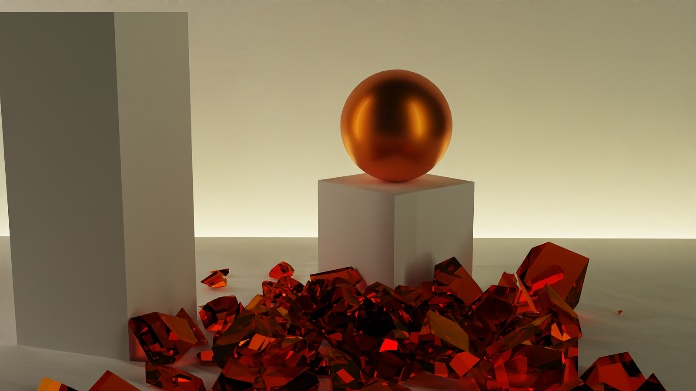
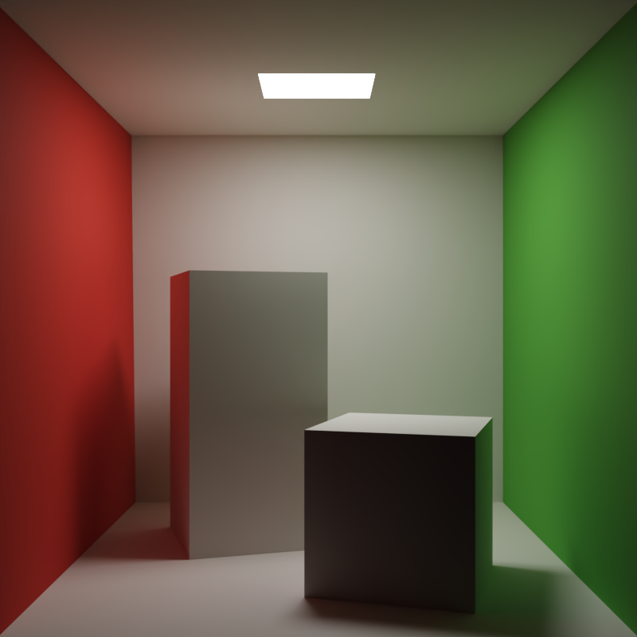

# LavaFrame

### A GPU based renderer.

=======
Join us on [Discord](https://discord.gg/wYaHPPrb7x)
(Currently only supports Windows - native Linux support coming in the future)

## Installation
Download one of the releases from the [releases tab](https://github.com/LavaFrame/LavaFrame/releases) on the right for Windows. Currently only Windows builds are set up - Linux builds will require manual building as no build system is currently set up for this task. This is planned to be adressed before version 1.0

## Usage
Launch the renderer by double-clicking the executable or launching it from the command line (allows for usage of CLI parameters).

## Contributing
Pull requests are welcome ! For major changes, please open an issue first to discuss what you would like to change.

## License
[MIT](https://choosealicense.com/licenses/mit/)

=======
The LavaFrame path tracing core is based on [this](https://github.com/knightcrawler25/GLSL-PathTracer) GLSL path tracing project by knightcrawler25
